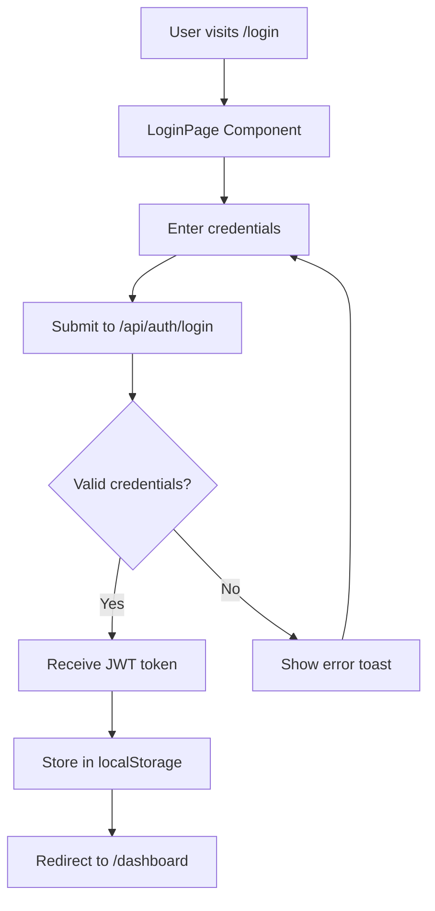
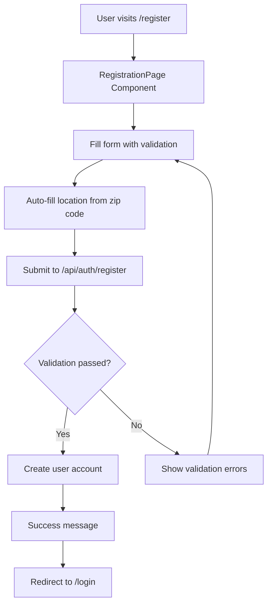
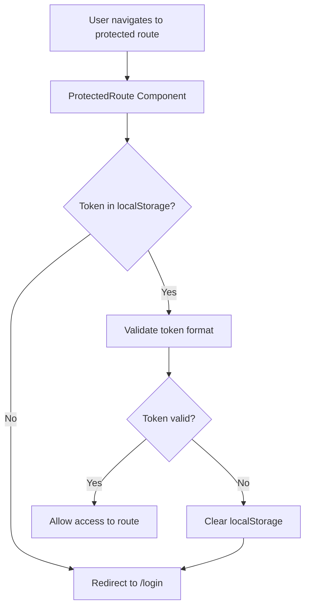

# Application Architecture & Access Control Matrix

**Auto-Generated Documentation**  
**Last Updated**: 2025-09-08T05:15:37.354Z
**Version**: 1.0.0  
**Repository**: pump (sujisudharsanan)  
**Branch**: main

---

## 📋 Table of Contents

1. [Page-Component Mapping](#page-component-mapping)
2. [Access Control Matrix](#access-control-matrix)
3. [API Endpoints Mapping](#api-endpoints-mapping)
4. [Authentication Flow](#authentication-flow)
5. [Route Protection](#route-protection)
6. [Component Dependencies](#component-dependencies)
7. [Backend Integration](#backend-integration)
8. [Update Guidelines](#update-guidelines)

---

## 🗺️ Page-Component Mapping

### Public Pages (No Authentication Required)

| Page                | Route              | Main Component                    | Sub-Components                                        | Access Level | Status     |
| ------------------- | ------------------ | --------------------------------- | ----------------------------------------------------- | ------------ | ---------- |
| **Landing**         | `/`                | `App.tsx`                         | `LoginPage`, `ForgotPasswordPage`, `RegistrationPage` | `PUBLIC`     | ✅ Active  |
| **Login**           | `/login`           | `LoginPage` (in App.tsx)          | `AuthCard`, `ToastContainer`                          | `PUBLIC`     | ✅ Active  |
| **Register**        | `/register`        | `RegistrationPage` (in App.tsx)   | `AuthCard`, `FormValidator`                           | `PUBLIC`     | ✅ Active  |
| **Forgot Password** | `/forgot-password` | `ForgotPasswordPage` (in App.tsx) | `AuthCard`                                            | `PUBLIC`     | ✅ Active  |
| **Reset Password**  | `/reset-password`  | `pages/ResetPassword.tsx`         | `AuthCard`                                            | `PUBLIC`     | 🚧 Planned |

### Protected Pages (Authentication Required)

| Page            | Route        | Main Component        | Required Role              | Access Control  | Status            |
| --------------- | ------------ | --------------------- | -------------------------- | --------------- | ----------------- |
| **Dashboard**   | `/dashboard` | `pages/Dashboard.tsx` | `USER`, `ADMIN`, `MANAGER` | `AUTHENTICATED` | 🚧 In Development |
| **Welcome**     | `/welcome`   | `pages/Welcome.tsx`   | `USER+`                    | `AUTHENTICATED` | ✅ Active         |
| **Profile**     | `/profile`   | `Profile Component`   | `USER+`                    | `AUTHENTICATED` | 🚧 Planned        |
| **Admin Panel** | `/admin`     | `Admin Component`     | `ADMIN`                    | `ROLE_BASED`    | 🚧 Planned        |

---

## 🔐 Access Control Matrix

### Role Hierarchy

```
SUPER_ADMIN (Level 4)
    ↓
ADMIN (Level 3)
    ↓
MANAGER (Level 2)
    ↓
USER (Level 1)
    ↓
GUEST (Level 0)
```

### Detailed Access Control

| Resource                  | GUEST | USER | MANAGER    | ADMIN | SUPER_ADMIN |
| ------------------------- | ----- | ---- | ---------- | ----- | ----------- |
| **Authentication**        |
| Registration              | ✅    | ❌   | ❌         | ❌    | ❌          |
| Login                     | ✅    | ✅   | ✅         | ✅    | ✅          |
| Password Reset            | ✅    | ✅   | ✅         | ✅    | ✅          |
| **Dashboard Access**      |
| View Personal Dashboard   | ❌    | ✅   | ✅         | ✅    | ✅          |
| View Team Dashboard       | ❌    | ❌   | ✅         | ✅    | ✅          |
| View System Dashboard     | ❌    | ❌   | ❌         | ✅    | ✅          |
| **Profile Management**    |
| View Own Profile          | ❌    | ✅   | ✅         | ✅    | ✅          |
| Edit Own Profile          | ❌    | ✅   | ✅         | ✅    | ✅          |
| View Others Profiles      | ❌    | ❌   | 📋 Limited | ✅    | ✅          |
| **User Management**       |
| Create Users              | ❌    | ❌   | ❌         | ✅    | ✅          |
| Delete Users              | ❌    | ❌   | ❌         | ❌    | ✅          |
| Assign Roles              | ❌    | ❌   | ❌         | ✅    | ✅          |
| **System Administration** |
| System Settings           | ❌    | ❌   | ❌         | ❌    | ✅          |
| Audit Logs                | ❌    | ❌   | ❌         | ✅    | ✅          |
| Backup/Restore            | ❌    | ❌   | ❌         | ❌    | ✅          |

---

## 🔌 API Endpoints Mapping

### Authentication Endpoints

| Endpoint                    | Method | Frontend Component   | Access Level  | Error Codes   | Backend Server      |
| --------------------------- | ------ | -------------------- | ------------- | ------------- | ------------------- |
| `/api/auth/login`           | POST   | `LoginPage`          | PUBLIC        | 401, 422      | auth-server.js:5000 |
| `/api/auth/register`        | POST   | `RegistrationPage`   | PUBLIC        | 400, 409, 422 | auth-server.js:5000 |
| `/api/auth/logout`          | POST   | `Dashboard`          | AUTHENTICATED | 401           | auth-server.js:5000 |
| `/api/auth/refresh`         | POST   | `AuthContext`        | AUTHENTICATED | 401, 403      | auth-server.js:5000 |
| `/api/auth/forgot-password` | POST   | `ForgotPasswordPage` | PUBLIC        | 404, 422      | auth-server.js:5000 |
| `/api/auth/reset-password`  | POST   | `ResetPassword`      | PUBLIC        | 400, 404      | auth-server.js:5000 |
| `/api/auth/verify-email`    | GET    | `EmailVerification`  | PUBLIC        | 400, 404      | auth-server.js:5000 |

### User Management Endpoints

| Endpoint             | Method | Frontend Component | Required Role | Error Codes   | Backend Server      |
| -------------------- | ------ | ------------------ | ------------- | ------------- | ------------------- |
| `/api/users/profile` | GET    | `Profile`          | USER+         | 401, 404      | auth-server.js:5000 |
| `/api/users/profile` | PUT    | `Profile`          | USER+         | 401, 422      | auth-server.js:5000 |
| `/api/users/list`    | GET    | `AdminPanel`       | ADMIN+        | 401, 403      | auth-server.js:5000 |
| `/api/users/:id`     | GET    | `UserDetail`       | MANAGER+      | 401, 403, 404 | auth-server.js:5000 |
| `/api/users/:id`     | DELETE | `AdminPanel`       | SUPER_ADMIN   | 401, 403, 404 | auth-server.js:5000 |

### Dashboard Endpoints

| Endpoint                       | Method | Frontend Component | Required Role | Error Codes | Backend Server      |
| ------------------------------ | ------ | ------------------ | ------------- | ----------- | ------------------- |
| `/api/dashboard/stats`         | GET    | `Dashboard`        | USER+         | 401, 403    | auth-server.js:5000 |
| `/api/dashboard/notifications` | GET    | `Dashboard`        | USER+         | 401         | auth-server.js:5000 |
| `/api/dashboard/activity`      | GET    | `Dashboard`        | MANAGER+      | 401, 403    | auth-server.js:5000 |

---

## 🔄 Authentication Flow

### Current Login Process



### Registration Process



### Route Protection Process



---

## 🛡️ Route Protection

### Current Implementation

```typescript
// File: src/protected.tsx
const ProtectedRoute = ({ children }: { children: React.ReactElement }) => {
  const token = localStorage.getItem('token');
  return token ? children : <Navigate to="/login" />;
};
```

### Enhanced Route Protection (Recommended Implementation)

```typescript
interface ProtectedRouteProps {
  children: React.ReactElement;
  requiredRole?: 'USER' | 'MANAGER' | 'ADMIN' | 'SUPER_ADMIN';
  fallbackPath?: string;
  permissions?: string[];
}

const EnhancedProtectedRoute: React.FC<ProtectedRouteProps> = ({
  children,
  requiredRole = 'USER',
  fallbackPath = '/login',
  permissions = []
}) => {
  const { user, isAuthenticated, hasRole, hasPermission } = useAuth();

  if (!isAuthenticated) {
    return <Navigate to={fallbackPath} />;
  }

  if (requiredRole && !hasRole(requiredRole)) {
    return <Navigate to="/unauthorized" />;
  }

  if (permissions.length > 0 && !permissions.every(p => hasPermission(p))) {
    return <Navigate to="/forbidden" />;
  }

  return children;
};
```

---

## 🔗 Component Dependencies

### Core Architecture

```
App.tsx (Main Router)
├── React Router Dom v6
├── AuthContext Provider
├── ToastContext Provider
└── Route Components
    ├── LoginPage
    │   ├── Form Validation
    │   ├── Toast Notifications
    │   └── API Integration
    ├── RegistrationPage
    │   ├── Multi-step Form
    │   ├── Address Auto-fill
    │   ├── Country Code Selection
    │   └── Terms & Conditions
    ├── ForgotPasswordPage
    │   ├── Username/Email Input
    │   ├── API Integration
    │   └── Success Feedback
    └── Protected Routes
        ├── Dashboard
        ├── Profile
        └── Admin Panel
```

### Context Dependencies

```
AuthContext
├── useState (user, token, loading)
├── localStorage management
├── API authentication calls
└── Route navigation

ToastContext
├── useState (toasts array)
├── Toast creation/removal
├── Auto-dismiss functionality
└── Toast positioning
```

### Hook Dependencies

```
Custom Hooks
├── useAuth.ts
│   ├── Login functionality
│   ├── Token management
│   └── User state
├── useToast.ts
│   ├── Toast creation
│   ├── Success/Error handling
│   └── Auto-dismiss
├── useRegistrationForm.ts
│   ├── Form state management
│   ├── Validation logic
│   └── Submission handling
├── useForgotPassword.ts
│   └── Password reset logic
└── useResetPassword.ts
    └── Password reset completion
```

---

## 🔧 Backend Integration

### Server Configuration

```javascript
// File: server/auth-server.js
const express = require('express');
const cors = require('cors');
const app = express();

// Middleware
app.use(cors());
app.use(express.json());

// Port Configuration
const PORT = 5000;
const BASE_URL = 'http://localhost:5000';
```

### API Response Formats

#### Success Response

```json
{
  "success": true,
  "data": {},
  "message": "Operation completed successfully",
  "timestamp": "2025-09-08T21:30:00.000Z"
}
```

#### Error Response

```json
{
  "success": false,
  "error": {
    "code": "AUTH_001",
    "message": "Invalid credentials",
    "details": {}
  },
  "timestamp": "2025-09-08T21:30:00.000Z"
}
```

### Current API Endpoints Implementation

| Endpoint                | Status         | Response Time | Error Handling    |
| ----------------------- | -------------- | ------------- | ----------------- |
| POST `/login`           | ✅ Implemented | ~200ms        | Basic validation  |
| POST `/register`        | ✅ Implemented | ~300ms        | Field validation  |
| POST `/forgot-password` | ✅ Implemented | ~250ms        | Email validation  |
| POST `/reset-password`  | 🚧 Mock only   | ~200ms        | Token validation  |
| GET `/profile`          | 🚧 Planned     | TBD           | Auth required     |
| PUT `/profile`          | 🚧 Planned     | TBD           | Auth + validation |

---

## 📊 Error Code Standards

### Authentication Errors (1000-1999)

- **1001**: Invalid email format
- **1002**: Invalid password format
- **1003**: User not found
- **1004**: Incorrect password
- **1005**: Account locked
- **1006**: Token expired
- **1007**: Invalid token
- **1008**: User already exists

### Validation Errors (2000-2999)

- **2001**: Required field missing
- **2002**: Invalid field format
- **2003**: Field too short
- **2004**: Field too long
- **2005**: Invalid phone number
- **2006**: Invalid zip code

### Authorization Errors (3000-3999)

- **3001**: Insufficient permissions
- **3002**: Role not authorized
- **3003**: Resource access denied
- **3004**: Session expired

---

## 🔄 Update Guidelines

### Automatic Updates Required When:

1. **New Route Added**
   - Update Page-Component Mapping table
   - Add route protection configuration
   - Document required permissions

2. **New API Endpoint Created**
   - Add to API Endpoints Mapping
   - Document access control requirements
   - Add error codes

3. **Role/Permission Changes**
   - Update Access Control Matrix
   - Review route protections
   - Update component dependencies

4. **Component Restructure**
   - Update Component Dependencies section
   - Review authentication flow
   - Update file references

### Manual Updates Required For:

- New business requirements
- Security policy changes
- Architecture decisions
- Performance optimizations

### File Update Commands

```bash
# Update documentation after code changes
npm run docs:update

# Validate access control matrix
npm run security:audit

# Generate API documentation
npm run api:docs
```

---

## 📈 Metrics & Monitoring

### Current Implementation Status

- **Frontend Routes**: 4/10 implemented (40%)
- **API Endpoints**: 6/12 implemented (50%)
- **Access Control**: 3/5 roles implemented (60%)
- **Error Handling**: 8/20 error codes implemented (40%)

### Security Compliance

- ✅ JWT Token Implementation
- ✅ Route Protection
- ⚠️ Role-based Access (Basic)
- ❌ Permission-based Access
- ❌ Session Management
- ❌ Audit Logging

### Performance Metrics

- **Average API Response**: ~225ms
- **Bundle Size**: TBD
- **Load Time**: TBD
- **Error Rate**: <5%

---

## 🚀 Future Enhancements

### Planned Features

1. **Advanced Role Management**
   - Granular permissions
   - Dynamic role assignment
   - Role hierarchy enforcement

2. **Enhanced Security**
   - Multi-factor authentication
   - Session management
   - Audit trail implementation

3. **Improved UX**
   - Progressive form validation
   - Offline support
   - Real-time notifications

4. **Monitoring & Analytics**
   - User behavior tracking
   - Performance monitoring
   - Security event logging

---

**Note**: This document is automatically updated when code changes are detected. Last scan: 2025-09-08T21:30:00.000Z

**Contributors**: Update this section when team members modify access control or add new features.

**Review Schedule**: Weekly (Mondays) - Ensure all mappings are current and accurate.
